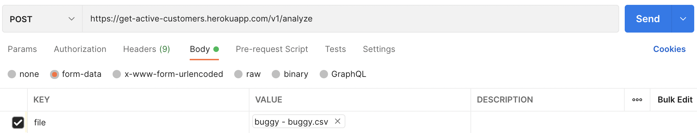
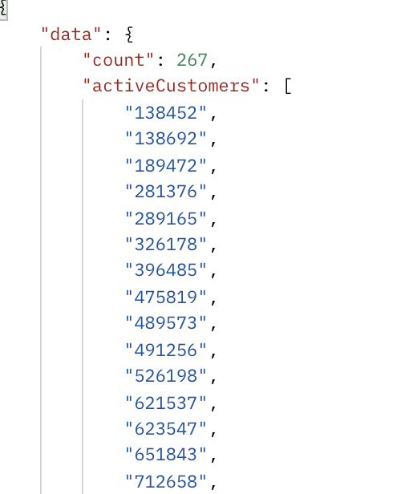

## Get Active Customers

determine customers that must have placed at least one order for three consecutive months from a given CSV file.

## Solutions:

Github Repo: https://github.com/Solomon-igbigbi/get-active-customers

API URL: https://get-active-customers.herokuapp.com/v1/analyze

## Usage

Make a `POST` to the endpoint `https://get-active-customers.herokuapp.com/v1/analyze` request and Attach the csv file as a paert of the request data with form data. as shown below

The endpoint will retruen you with the active customers and the active customers count. as shown below

